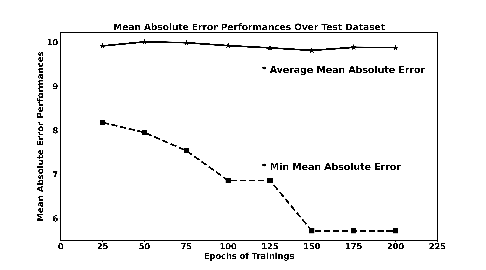
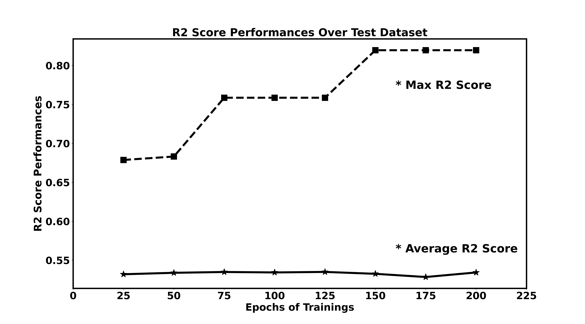
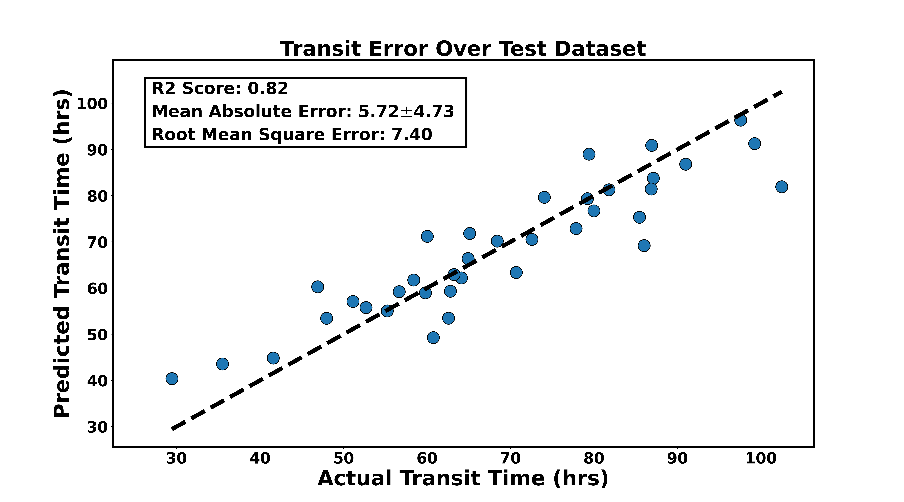
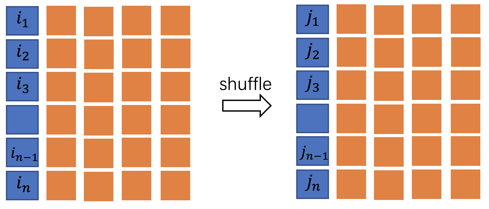

    
    
    
    

### Prediction of the transit time of coronal mass ejections with an ensemble machine learning method [The Astrophysical Journal Supplement Series] 

`Yun Yang, Jia Jia Liu, XueShang Feng, Peng Fei Chen, Bin Zhang`

``Coronal mass ejections (CMEs), a kind of violent solar eruptive activities, exert a significant impact on space weather. When arriving at the Earth, they interact with the geomagnetic field, which can boost the energy supply to the geomagnetic field and may further result in geomagnetic storms, thus having potentially catastrophic effects on human activities. Therefore, accurate forecast of the transit time of CMEs from the Sun to the Earth is vital for mitigating the relevant losses brought by them. XGBoost, an ensemble model which has better performance in some other fields, is the first time to be applied to the space weather forecast. During multiple tests with random data splits, the best mean absolute error (MAE) of ~5.72 hours was obtained, and in this test, 62% of the test CMEs had absolute arrival time error of less than 5.72 hours. The average MAE over all random tests was ~10 hours. It indicates that our method has a better predictive potential and baseline. Moreover, we introduce two effective feature importance ranking methods. One is the information gain method, a built-in method of ensemble models. The other is the permutation method. These two methods combine the learning process of the model and its performance to rank the CME features, respectively. Compared with the direct correlation analysis on the sample data set, they can help select the important features that closely match the model. These two methods can assist researchers to process large sample data sets, which often require feature selection in advance `

  

    
     
    Figure 1. Frequency distribution of 18 features of the CME and solar wind.
      

  

    
     
    Figure 2. The average and minimum MAE of trainings trained
      

  

    
     
    Figure 3. The average and maximum R2 of trainings trained
      

  

    
     
    Figure 4. The predicted transit time by XGBoost model versus the actual transit time for CMEs in the test set. The black dashed line denotes the perfect matching between the predicted and actual transit time. 
      

  

    
     
    Figure 5. Feature importance ranking obtained by the information gain method
      

  

    
     
    Figure 6. Feature importance ranking obtained by the permutation method
      

  

    
     
    Figure 7. Schematic diagram of the shuffle process. Each column represents one kind of feature variable. i1, i2, · · · , in denotes the original order of the data in one column. After a shuffle, the order of data becomes j1, j2, · · · , jn
      

  

    
     
    Figure 8. Variation of the MAE for each feature during 100 shuffles
      

# Contact Us

If you have any questions about the papers or codes, you can contact us by emailing to yangyun1073@163.com

## License

<a href="https://github.com/wumingwuyan/CME/blob/master/LICENSE">Apache 2.0 license</a>